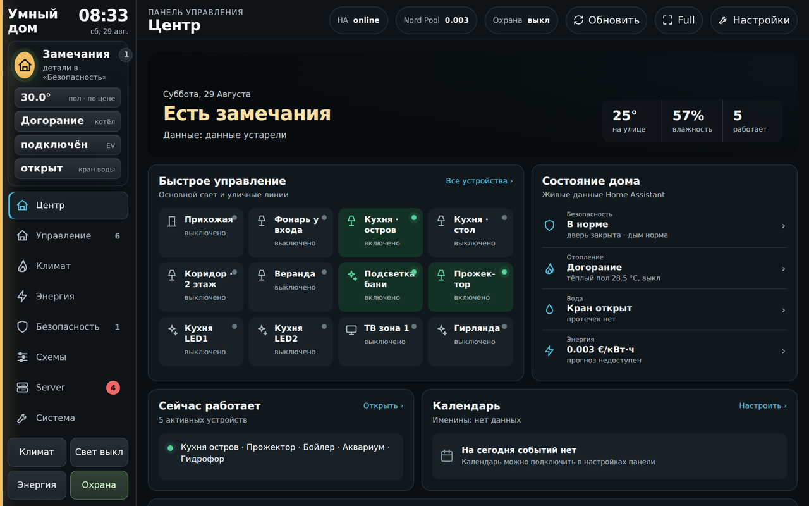
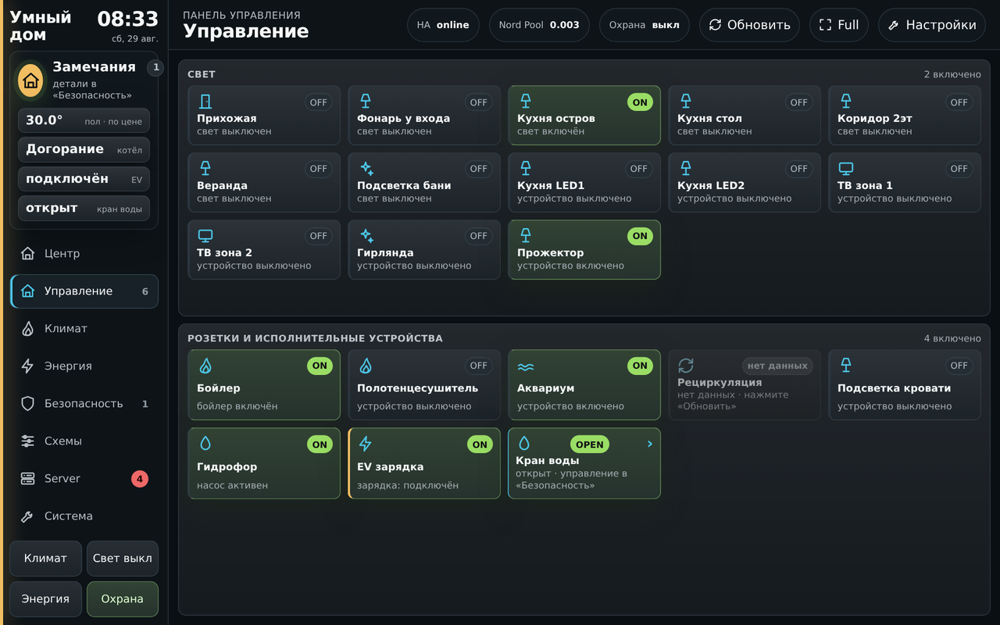
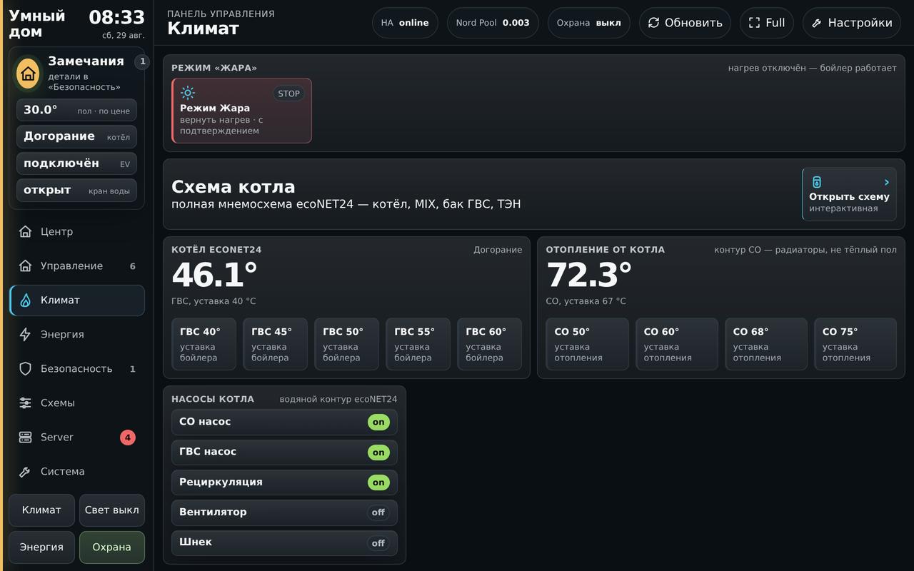
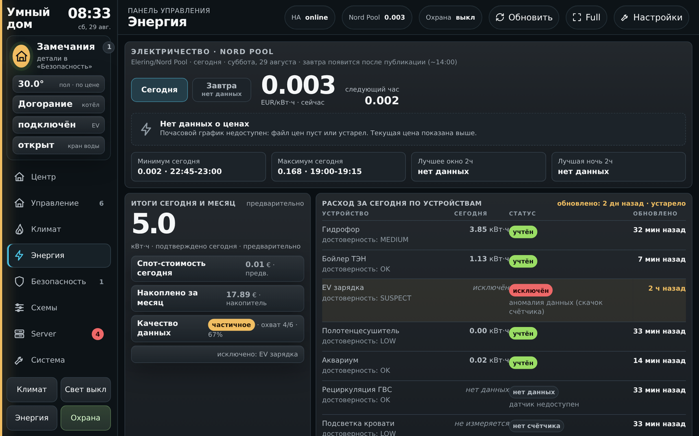
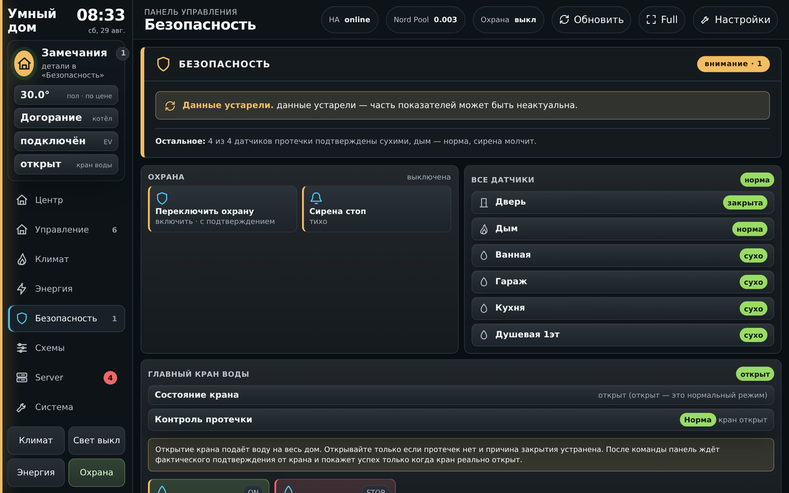
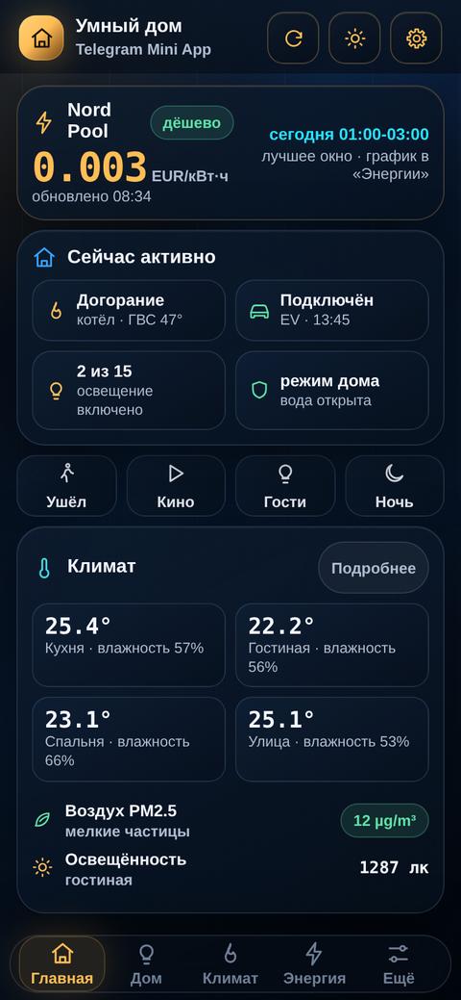
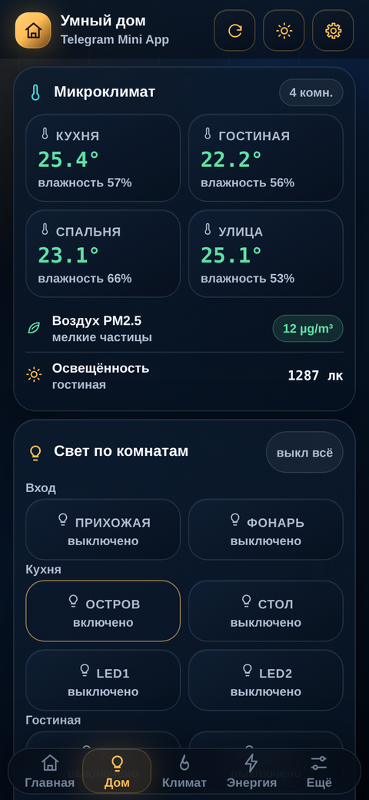
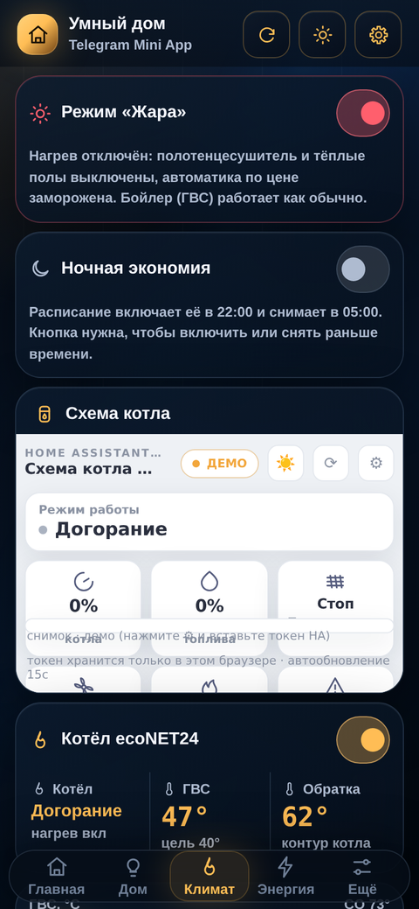
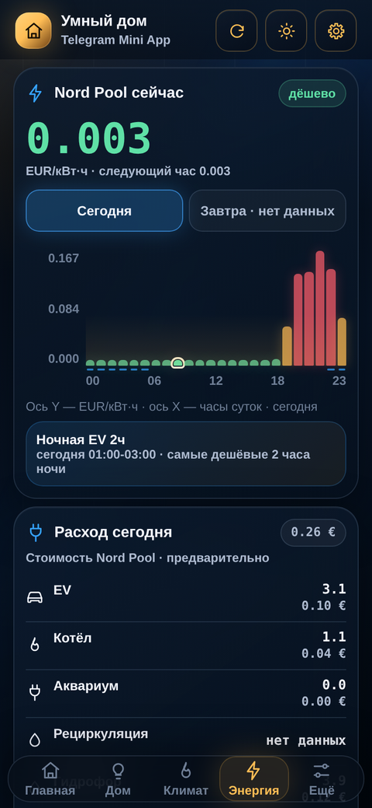

# MySmartHome

[](https://www.home-assistant.io/)
[](tests/)
[](https://www.python.org/)

Home Assistant control surfaces and automation logic for a real, lived-in house in Riga, Latvia:
a Telegram Mini App, a wall-tablet command panel, EV charge scheduling against day-ahead
electricity prices, a pellet-boiler integration, water-leak protection, and a set of watchdogs
that report when any of it stops working.

This is a working system, not a demo. Every screenshot below is a real render of the real UI —
readings are live, identifying details are replaced.

> **Not a plug-and-play distribution.** Entity ids, device models and the wiring are specific to
> this house. Take the parts that are useful (the Mini App auth model, the watchdog patterns,
> the price schedulers) and adapt them. See [SETUP.md](SETUP.md).

---

## Tablet command panel

A wall tablet (Samsung SM-T595, 1280×800) runs a single custom `panel_custom` element — one
screen per system, no scrolling hunt for a switch.



The home screen answers the questions the house actually gets asked: is anything wrong, what is
the electricity price doing, what is running, is the water valve open.

<p>
  
  
</p>
<p>
  
  
</p>

## Telegram Mini App

The same house from a phone, inside Telegram. The browser never sees a Home Assistant token.

<p>
  
  
  
  
</p>

---

## What it does

**Electricity price optimisation.** Nord Pool LV / Elering day-ahead prices drive the boiler
element, the towel rail, both floor-heating zones and EV charging. The EV scheduler picks the
cheapest 2-hour window; one-shot "charge tonight / charge today" requests override the schedule
exactly once.

**Water-leak protection.** Four moisture sensors, a motorised main valve and a siren. One
entity — `sensor.leak_protection_status` — is the single source of truth (`leak` / `blind` /
`ok`), and every UI reads only that. A separate cloud path double-checks the sensors, and a
watchdog reports within 10 minutes if the protection goes blind.

**Floor heating that respects a human.** The price automations normally run the floors, but a
setpoint set by hand wins: the house detects a human action (`context.user_id`), switches the
thermostat to manual, holds the temperature for a configurable window and tells you when the
hold expires.

**Pump and water monitoring.** The pressure pump's run time is derived from its cumulative
energy counter (which survives connectivity gaps), and a nightly check flags any pumping during
the quiet hours — the specific signature of a leak or a waterlogged expansion tank.

**Watchdogs over everything.** Boiler alarm state, siren availability, EV schedule, Proxmox
backups, frozen device states, Tuya session breaks, gateway loss. All notification-only by
default: they tell you, they do not act.

---

## Architecture

```
Telegram  ─┐
Tablet    ─┼─►  Home Assistant  ─►  Tuya cloud / Zigbee gateway  ─►  devices
Browser   ─┘         │
                     ├─ custom component: Telegram initData auth + allow-listed actions
                     ├─ automations: price logic, safety interlocks, watchdogs
                     └─ command_line + REST: EV charger, pellet boiler (ecoNET24)
```

**The Mini App never holds a token.** Telegram signs `initData`; the custom component verifies
the HMAC, checks freshness, pins the allowed Telegram user, and only then calls a service — from
a fixed allow-list of entities and services. An unknown entity is a 403, not a surprise.

**The tablet panel is a single ES module** served from `/local/`, registered through
`panel_custom`. Because Home Assistant serves `/local/` with a 31-day cache, the panel carries
its own build stamp and polls a tiny sidecar to notice a new version and reload itself once.

---

## Repository layout

| Path | What lives there |
|---|---|
| `miniapp/` | Telegram Mini App (`smarthouse_v8.html`) and self-contained React visualisations |
| `custom_components/miniapp_auth/` | HA custom component: initData validation + action proxy |
| `tablet/` | Panel assets and templates (deployed builds stay out of Git) |
| `ev_*.py`, `price_forecast.py` | Price fetching and EV charge-window scheduling |
| `tools/` | Secret scanner, log fetcher, floor-plan renderer |
| `tests/` | 662 hermetic tests — no network, no Home Assistant needed |
| `ha-config/` | The Home Assistant config itself — `configuration.yaml`, 80 automations, 20 scripts (anonymised) |
| `docs/` | Runbooks, device notes, audit reports, orchestrator rules |

## The Home Assistant config itself

The interesting part of a smart home is not the UI, it is the rules. [`ha-config/`](ha-config/)
holds anonymised copies of what actually runs: `configuration.yaml` (helpers, template sensors,
REST and command_line integrations), `automations.yaml` (80 automations) and `scripts.yaml`.

Most of the reasoning lives in comments next to the code — why a threshold is what it is, which
incident produced it, and what must not be changed. Start with the leak-protection template, the
floor-heating manual hold, and any watchdog.

## Tests

```bash
python3 -m pytest tests/ -q
```

Everything runs offline against fixtures. The suite is mostly *doctrine* tests: they assert the
invariants that were paid for in incidents — a leak alarm may never be silenced by a stale
sensor, a Telegram button must use an integer `chat_id`, a build stamp must match its sidecar,
"no data" must never render as a zero.

## Safety model

This system controls water, heating and a car charger, so the rules are explicit:

1. Analysis never implies a change; a change never implies a deploy; a deploy never implies a
   physical test.
2. Anything that could act on water or heating is confirmed with the owner first.
3. Unreadable is not the same as off. A missing reading renders as "no data", never as `0`.
4. Watchdogs notify; they do not take action on their own.
5. No secret is ever committed. Credentials live in a local secrets file that Git ignores, and
   two scanners run on every commit: `tools/secret_scan.py` for credentials and
   `tools/pii_scan.py` for personal data.
6. Personal data is caught by **enumeration, not by pattern-matching known values**. Searching
   for what you already know can only find what you already know — that is how a Gmail address,
   a Xiaomi account id and a machine name survived two earlier passes. `pii_scan.py` lists every
   e-mail, coordinate, MAC, login and home path it can find and fails on anything that is not on
   an explicit allow-list.
7. Machine-generated exports are not published. Every leak found so far came from a dump of the
   live system — an integration inventory, an entity registry. Only authored code, tests and
   reports go out.

## Licence

No licence granted yet — published for reference. Ask before reusing wholesale.
